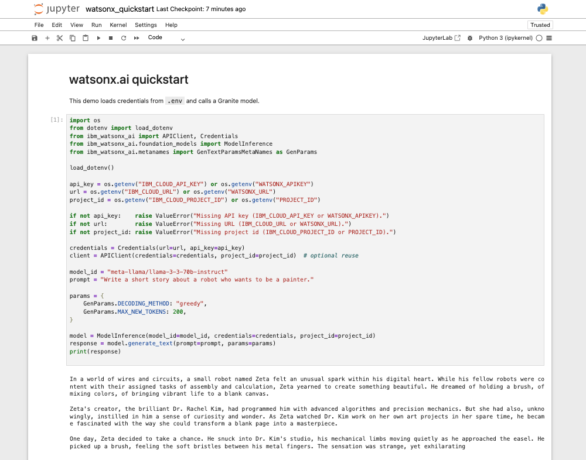

<div align="center">
  <a href="https://www.python.org" target="_blank"></a>
  <a href="https://www.docker.com/" target="_blank"></a>
  <a href="https://jupyter.org/" target="_blank"></a>
</div>

# simple-watsonx-enviroment — Python 3.11 + Jupyter + IBM watsonx.ai

A minimal, production-ready **Python 3.11** environment with **Jupyter Notebook** and **IBM watsonx.ai** integration. Run locally (virtualenv) or in a **Docker** container. Includes a ready-to-use notebook that reads credentials from `.env` and calls Granite/Llama models on watsonx.ai.

> 🔐 You need an IBM Cloud API key and a watsonx.ai **project_id** (or `space_id`) to run inference.

---

## What’s included

* **Jupyter-ready**: Registers a kernel named **Python 3.11 (watsonx-env)**.
* **watsonx.ai SDK**: `ibm-watsonx-ai` plus `langchain-ibm` for LangChain integration.
* **.env support**: `python-dotenv` loads your credentials automatically in notebooks.
* **Dockerfile**: PEP 668–safe install via a dedicated venv, fast, multi-arch-friendly.
* **Makefile**: Cross-platform targets (Windows/macOS/Linux) for install, update, Docker build/run.




---

## 🚀 Quick start

### 1) Configure credentials

Copy the sample and fill in your values:

```bash
cp .env.sample .env
# edit .env with your IBM Cloud credentials
```

Supported variable names (both styles work):

```bash
# IBM-style (preferred)
IBM_CLOUD_API_KEY=...
IBM_CLOUD_URL=https://us-south.ml.cloud.ibm.com
IBM_CLOUD_PROJECT_ID=...

# Compatibility
WATSONX_APIKEY=...
WATSONX_URL=https://us-south.ml.cloud.ibm.com
PROJECT_ID=...
```

---

### 2) Local (virtualenv)

```bash
make install
jupyter notebook
```

Then open **`notebooks/watsonx_quickstart.ipynb`** and run the cells.

> Kernel name: **Python 3.11 (watsonx-env)**

---

### 3) Docker (recommended for consistency)

**Build**

```bash
make build-container
```

**Run** (reads `.env`, mounts current dir to `/workspace`)

```bash
make run-container
```

and you simple click

```bash
Container is up at http://localhost:8888
```

or if you rant do manually

```bash
docker run -d --name watsonx-env \
  --env-file .env \
  -p 8888:8888 \
  -v "$(pwd)":/workspace \
  simple-watsonx-env:latest

# Jupyter → http://localhost:8888
```

> Your local project folder is mounted at `/workspace`, so notebooks and edits persist on your host.

---

## 🧪 Example: basic inference

```python
import os
from dotenv import load_dotenv
from ibm_watsonx_ai import APIClient, Credentials
from ibm_watsonx_ai.foundation_models import ModelInference
from ibm_watsonx_ai.metanames import GenTextParamsMetaNames as GenParams

load_dotenv()

api_key = os.getenv("IBM_CLOUD_API_KEY") or os.getenv("WATSONX_APIKEY")
url = os.getenv("IBM_CLOUD_URL") or os.getenv("WATSONX_URL")
project_id = os.getenv("IBM_CLOUD_PROJECT_ID") or os.getenv("PROJECT_ID")

if not api_key:    raise ValueError("Missing API key (IBM_CLOUD_API_KEY or WATSONX_APIKEY).")
if not url:        raise ValueError("Missing URL (IBM_CLOUD_URL or WATSONX_URL).")
if not project_id: raise ValueError("Missing project id (IBM_CLOUD_PROJECT_ID or PROJECT_ID).")

credentials = Credentials(url=url, api_key=api_key)
client = APIClient(credentials=credentials, project_id=project_id)  # optional reuse

model_id = "ibm/granite-13b-instruct-v2"
prompt = "Write a short story about a robot who wants to be a painter."

params = {
    GenParams.DECODING_METHOD: "greedy",
    GenParams.MAX_NEW_TOKENS: 200,
}

model = ModelInference(model_id=model_id, credentials=credentials, project_id=project_id)
response = model.generate_text(prompt=prompt, params=params)
print(response)
```

---

## 🔌 Optional: LangChain

```python
from langchain_ibm import WatsonxLLM
from dotenv import load_dotenv
import os

load_dotenv()
api_key = os.getenv("IBM_CLOUD_API_KEY") or os.getenv("WATSONX_APIKEY")
url = os.getenv("IBM_CLOUD_URL") or os.getenv("WATSONX_URL")
project_id = os.getenv("IBM_CLOUD_PROJECT_ID") or os.getenv("PROJECT_ID")

llm = WatsonxLLM(
    model_id="ibm/granite-13b-instruct-v2",
    url=url,
    apikey=api_key,
    project_id=project_id,
    params={"decoding_method": "greedy", "max_new_tokens": 128}
)

print(llm.invoke("Give me 3 study tips for Python."))
```

---

## 🧰 Make targets

* `make install` → create venv, install deps, register Jupyter kernel
* `make update` → upgrade/sync deps
* `make build-container` → build Docker image `simple-watsonx-env:latest`
* `make run-container` → run the container with your **.env** and project mounted
* `make clean` / `make clean-venv` → cleanup

---

## 🐳 Pull & run prebuilt images

If the image is hosted on a registry (e.g., Docker Hub or GHCR), you can skip local build and run it directly.

**Pull**

```bash
# Docker Hub (example)
docker pull ruslanmv/simple-watsonx-env:latest
```

**Run (with .env)**

```bash
# Ensure you have a .env in your current directory!
docker run -d --name watsonx-env \
  --env-file .env \
  -p 8888:8888 \
  -v "$(pwd)":/workspace \
  ruslanmv/simple-watsonx-env:latest
```

**Flag notes**

* `--env-file .env` → injects `IBM_CLOUD_API_KEY`, `IBM_CLOUD_URL`, `IBM_CLOUD_PROJECT_ID` without hard-coding them in your command.
* `-v "$(pwd)":/workspace` → mounts your repo so notebook edits persist.
* `-p 8888:8888` → exposes Jupyter on your host.

---

## 🧩 Customization

* Add/lock dependencies in `pyproject.toml`, then run `make update` (local) or rebuild the Docker image.
* Swap models by changing `model_id` (e.g., `ibm/granite-13b-instruct-v2`, `meta-llama/llama-3-3-70b-instruct`, etc.).
* For teams: store secrets in your CI/CD and pass as envs to `docker run` instead of a local `.env`.

---

## 🔧 Troubleshooting

* **401/403** → Verify API key, project/space access, and region URL.
* **`.env` not loading** → Ensure it’s in the repository root and `load_dotenv()` is called early.
* **Kernel missing in Jupyter** → `make install` (or `make notebook`) and restart Jupyter.
* **Corporate proxies** → set `HTTP_PROXY` / `HTTPS_PROXY` when building/running Docker.

---

## 📝 License

Apache-2.0 (see `LICENSE` if present). Contributions welcome!
